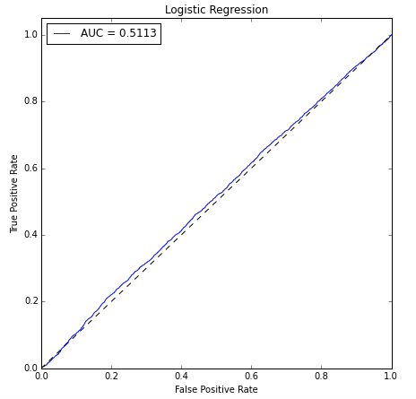

# Classification_algorithms_predicting_home_loans
Predicting if a client will say yes for a home loan

### Data
The data used is marketing information for a Portuguese bank.

### Model Selection
To choose a model, it is important to decide if recall-score is important or precision because, it we don’t want to lose potential clients to the company we want the recall to be high (since high recall implies low false negative). and if we don’t want to waste resources on false positives, then precision is important. 

Below is the summary of my results.

| Model              |  Recall  |   Precision  |  f1_score  |   CV_score
 ———————————————————————————————————————————————————————————————————
|Logistic Regression |   0.54   |     0.49     |    0.39    |    0.53
|KNN		             |	 0.50	  |     0.50     |    0.50    |    0.50
|Gausian Naive Bayes |	 0.50	  |     0.52     |    0.48    |    0.49
|MultinomialNB	     |   0.53   |     0.50     |    0.42    |    0.53
|BernoulliNB	       |   0.53   |     0.51     |    0.47    |    0.52
|SVM     	           |   0.53   |     0.50     |    0.44    |    0.53
|Decision Tree	     |   0.51   |     0.51     |    0.51    |    0.50
|Random Forest       |   0.50   |     0.51     |    0.50    |    0.50

Based on the above results, I chose logistic regression because it has high recall and cross-validation scores. And also Logistic regression is a simpler model. 

Below is the ROC curve for Logistic regression.

### Cross-validation methods:

To do the cross-validation, I chose 10 fold validation on all the models and made my final decision based on this score. 

### Scale to classify millions of example:

Both logistic regression and random forest are effective at scaling to a huge data set.

### Translate model to other languages:

Logistic regression is practical to translate into an other language.
